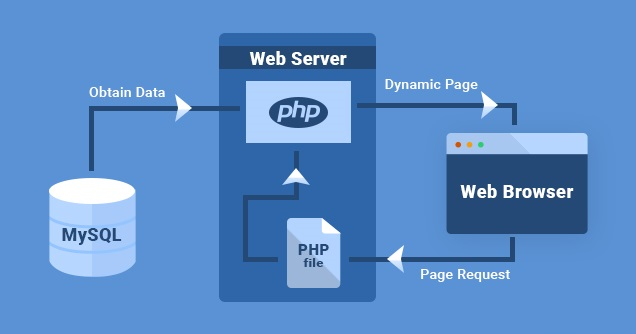
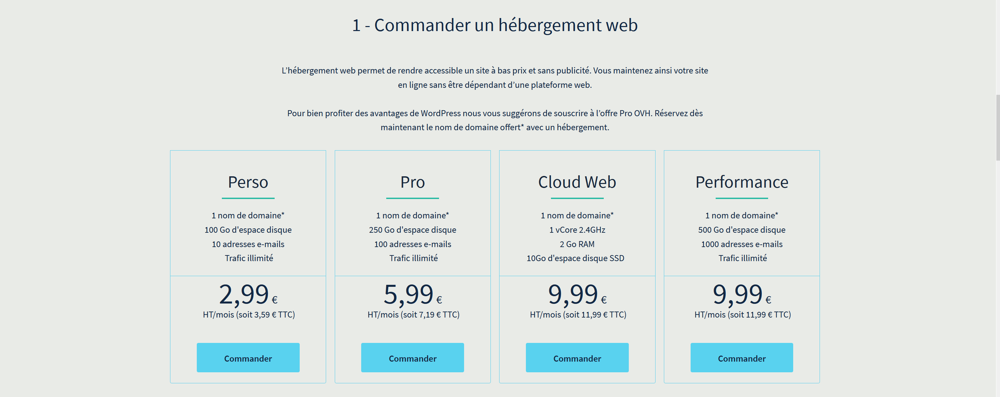
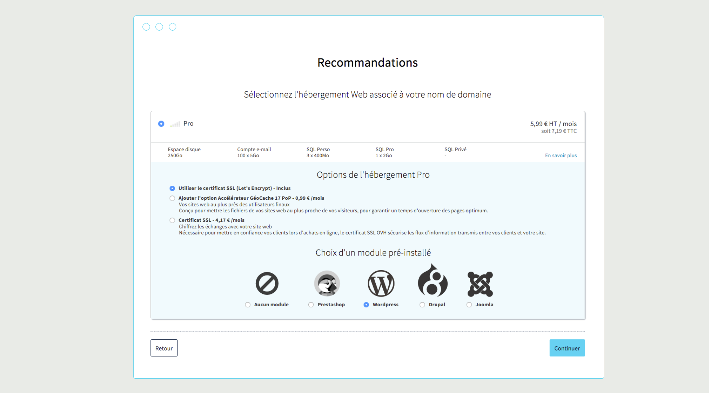
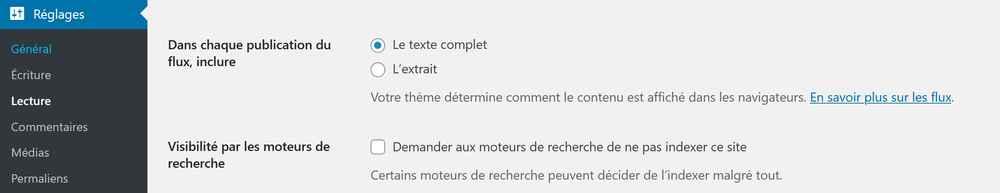
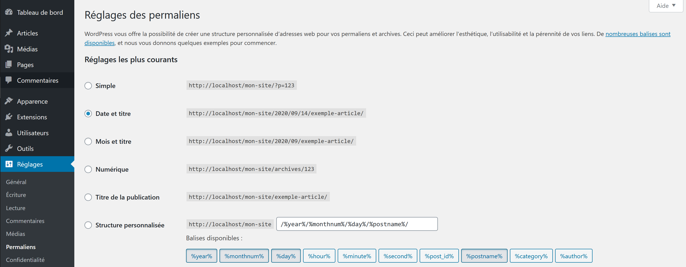

# Installation

* 🔖 **Le CMS**
* 🔖 **Local**
* 🔖 **Hébergé**
* 🔖 **Présentation**

___

## 📑 Le CMS

Un système de gestion de contenu ou SGC est une famille de logiciels destinés à la conception et à la mise à jour dynamique de sites Web ou d'applications multimédia. Wordpress est l'un des plus populaires des CMS.

### 🏷️ **Wordpress**

De nombreuses propositions de représentations graphiques pou les langages orientés objets on été formulés.

___

## 📑 Local

Il est possible d'installer Wordpress localement, c'est à dire avoir son code source et sa base de donnée sur sa machine. L'avantage est de ne publier et de mettre en ligne que des versions stables du site, l'autre avantage est la création de sauvegarde manuellement, la copie, l'envoie du projet.

Wordpress s'exécute sur un serveur interprettant le langage PHP et utilisant une base de données MySql.

### 🏷️ **Server**

Nous allons installer un serveur local pour satisfaire ses prérequis. Il y a plusieurs distributions équivalentes, xampp, wampp, lampp, mampp. Je conseil xampp qui est simple et efficace.

___

👨🏻‍💻 Manipulation

Installer [xampp server](https://www.apachefriends.org/fr/index.html).

___

Le serveur s'arrête ou se démarre facilement avec les touches `Start/Stop`, les services à activer sont `Apache` pour interpréter PHP et `MySql` pour utiliser les bases de données. En démarrant les services, vous pouvez vous rendre à l'adresse [http://localhost/](http://localhost/) de votre navigateur. Sur un domaine localhost vous déservez les fichiers qui se trouvent dans le dossier `C:\xampp\htdocs`. C'est dans ce dossier que vous devrez positionner Wordpress.

### 🏷️ **Wordpress**

Pour installer wordpress il faut dans un premier temps télécharger le code source à l'adresse [https://fr.wordpress.org/download/](https://fr.wordpress.org/download/). Puis vous devez extraire le dossier archivé dans le répertoire cité (`C:\xampp\htdocs`). Ceci était fait, vous pouvezz renomer le dossier pour qu'il correspond à un de vos futurs projet!

### 🏷️ **Base de données**

Pour fonctionner, Wordpress a besoin d'une base de données existante. Nous possédont un utilitaire pour en créer une. Cet utilitaire s'appe PhpMyAdmin, vous pouvez y avoir accès en vous rendant à l'adress [http://localhost/phpmyadmin](http://localhost/phpmyadmin).

Une fois sur la page d'accueil de PhpMyADmin, nous nous rendrons sur l'onglet Base de données puis nous créerons une base de donnée en spécifiant un nom.

### 🏷️ **Initialisation**

Tous les prérequis sont satisfaits, nous pouvons demander l'initialisation de Wordpress.

En vous rendant à l'adresse [http://localhost/mon-site/index.php](http://localhost/mon-site/index.php) vous serez dirigé vers la page d'initialisation du site. Vous devez renseigner plusieurs informations, le nom du site, votre nom d'utilisateur, le mot de passe de connexion. Enfin il vous est demandé les informations de connexion à la base de données, pour un serveur fraihement installé, le nom d'utilisateur est `root` et le mt de passe est vierge.

Laissez vous guider c'est parti!

___

👨🏻‍💻 Manipulation

Initialiser un projet Wordpress

___

## 📑 Hébergé

Votre projet devra être hébergé chez un hebergeur pour être visible par tous. Chez un hébergeur il faudra souscrire à une formule avec nom de domaine et hébergement, qui correspond à un espace disque sur lequel votre nom de domaine pointe. Il y a de nombreux hebergeurs comme par exemple [ovh](https://www.ovh.com/fr/hebergement-web/site/wordpress.xml).

Une fois en possétion des prérequis que sont nom de domaine et hébergement, vous pouvez au clic demander une installation de wordpress.

Votrep rojet est prêt à être modifié, il faudra apprendre à récupérer le contenu en local pour travailler sans porter atteinte au fonctionnalités et contenu existants.

___

👨🏻‍💻 Manipulation

Créer un compte chez un hébergeur payant ou chez un hébergeur gratuit comme [alwaysdata](https://www.alwaysdata.com/fr/)

___

## 📑 Présentation

Il est temps de faire un premier tour de Wordpress.

### 🏷️ **Connection**

Votre initialisation du projet terminé, vous pouvez vous connecter à l'adresse suivante [http://localhost/mon-site/wp-login.php](http://localhost/mon-site/wp-login.php).

### 🏷️ **Présentation**

Une fois connecté, le tableau de boar est disponbile, sur la gauche le menu d'administration permet d'accéder aux différents réglages du site.

#### **Réglages**

* Indexation

Vous pouvez demander aux moteur de recherche d'indexer ou pas votre site.

* Permalien

Vous pouvez choisir la structure de vos url en réglant les `permaliens`.

___

👨🏻‍💻 Manipulation

Réglez votre permalien

___