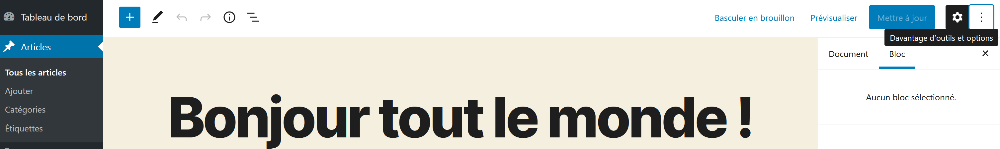
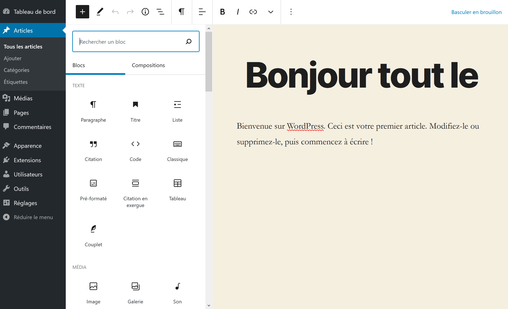
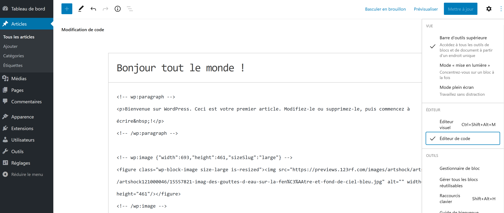

# [Edition](https://wordpress.com/fr/support/editeur-wordpress/)

* 🔖 **Gutenberg**
* 🔖 **Les blocs**
* 🔖 **Migration**

___

## 📑 [Gutenberg](https://fr.wordpress.org/gutenberg/)

Depuis la version 5 de Wordpress il y a un éditeur nommé `Gutenberg` qui permet l'édition du contenu de façon plus simple et structuré.



___

## 📑 [Les blocs](https://wordpress.com/fr/support/editeur-wordpress/blocs/)

Les blocs sont des composants d’ajout de contenu dans le nouvel éditeur de blocs de WordPress. De nombreux types de blocs différents sont disponibles.



Les différents blocs sont ordonnée par catégories, permettant de facilement identifier l'utilisation d'un bloc.


### 🏷️ **Mode**

Vous pouver accéder au code source des blocs pour éditer en HTML votre contenu.


___

👨🏻‍💻 Manipulation

Rédiger un contenu en utilisant des blocs

___

## 📑 Migration

Pour transformer du contenu textuel provenant d'un ancien article en contenu éditable par bloc il faut délimiter votre texte par des commentaires les transformant en bloc dans l'éditeur. L'édition doit se faire dans le mode observé précédement.

```html
<!-- wp:paragraph -->
<p>Bienvenue sur WordPress. ...</p>
<!-- /wp:paragraph -->
```