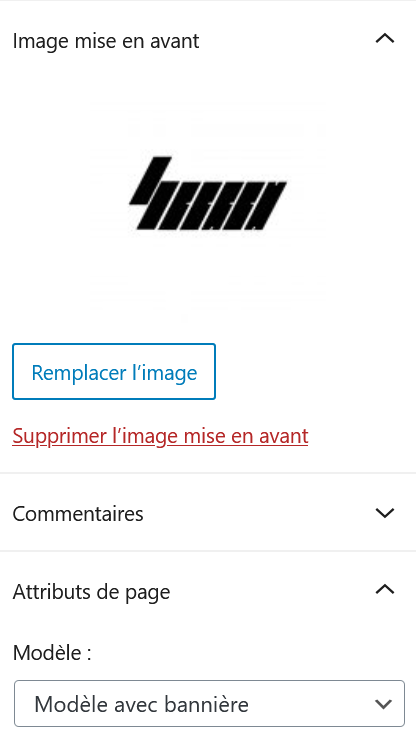

# [Pages](https://wordpress.com/fr/support/pages/)

* 🔖 **Modèle**
* 🔖 **Ordre**

___

## 📑 Modèle

Il est possible de choisir un modèle de page ou d'article.

Les modèles dépendent de ceux que propose le thème.

___

## 📑 Ordre

L'ordre permet de définir l'ordre du lien vers la page par défaut dans le menu du thème.

___

👨🏻‍💻 Manipulation

Crez des pages en choisissant le modèle et l'ordre.
___
