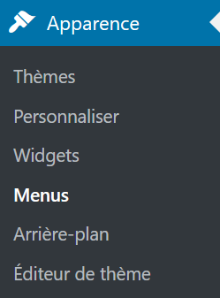
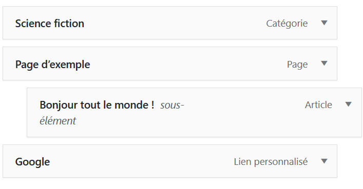

# [Menu](https://wordpress.com/fr/support/menus/)

* 🔖 **Créer**
* 🔖 **Utiliser**
* 🔖 **Widget**

___

## 📑 Créer

Il est possible de créer un menu identifié.

___

## 📑 Utiliser

Les menus peuvent contenir des liens vers des articles, des pages et des pages de catégories ainsi que des liens personnaliés et ce hierarchiquement.

L'emplacement du menu en fonction du thème peut être personnalisé.

___

## 📑 Widget

Il est possible dans les widget de relier à menu à un widget de navigation et de le positionner dans les emplacements offerts par le thème.

___

👨🏻‍💻 Manipulation

Créer un menu principal et secondaire.
___
