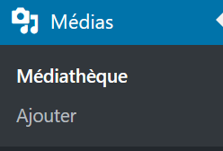
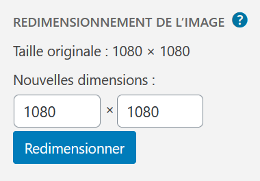
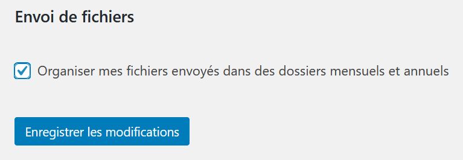

# Les Médias

* 🔖 **Les formats**
* 🔖 **Importer**
* 🔖 **Organiser**

___

## 📑 Les formats

Il est possible d'imporer différents types de média, des images, des feuilles de calcul, vidéo et autre.

Concernant le format des images il faut différencier `jpg` et `png`.

Le format jpg est un format propriétaire qui ne possède pas de couche alpha concernant l'opacité contrairement au format png.

Donc quand vous voulez des images qui gèrent la transparence vous devez alors utiliser le format png.

Pour maîtriser la transparence de vos images vous devez utilier des logiciels de création graphique comme Photoshop.

___

## 📑 Importer

Vous pouvez ajouter un fichier sur l'onglet Médias.

Une fois un média ajouté vous pouvez le redimensionner.

___

## 📑 Organiser

Par défaut les images s'organisent dans des dossiers par date. Il faudra utiliser une extension pour avoir une meilleur organisation avec la création de dossier personnalisé.

